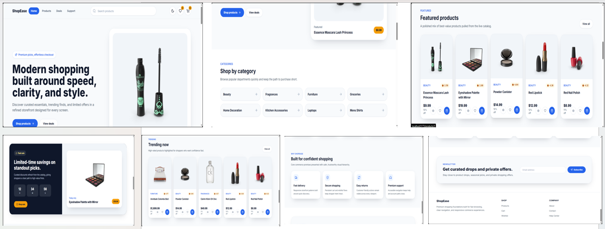
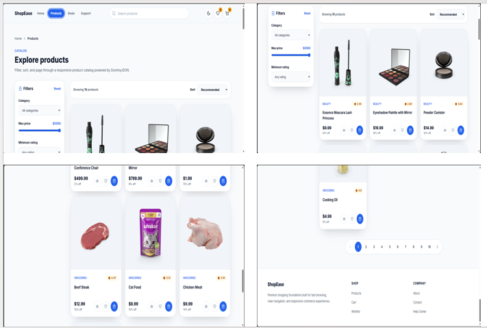
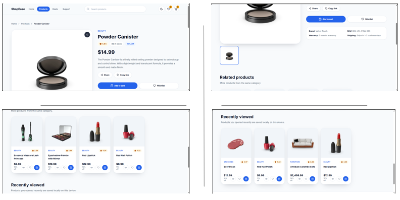
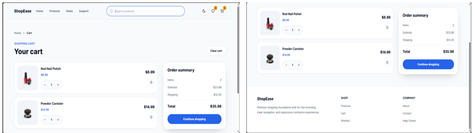
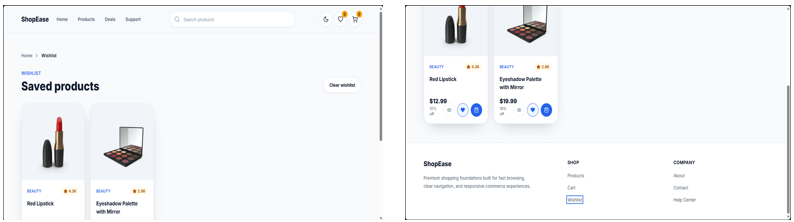
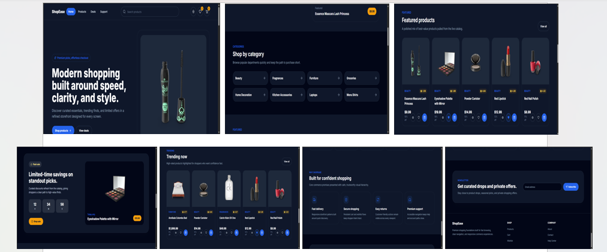

# 🛍️ ShopEase — Modern E-Commerce Frontend

> **A modern, responsive e-commerce shopping experience built with React, Vite and Tailwind CSS.**

ShopEase is a frontend-focused e-commerce application designed to deliver a smooth and intuitive online shopping experience across desktop, tablet and mobile devices.

The application combines a clean, responsive interface with real-time product data, advanced product discovery, cart and wishlist management, persistent client-side state, dark mode, animations and thoughtful loading/error states.

---

## ✨ Highlights

🛒 **Complete Shopping Experience**
Browse products, explore details, manage cart items and maintain a personalized wishlist.

🔎 **Smart Product Discovery**
Search products with debounced live search, suggestions, filtering, sorting and pagination.

❤️ **Persistent Wishlist & Cart**
Cart and wishlist state are maintained using React Context API and LocalStorage.

🌙 **Dark Mode**
Switch between light and dark themes with the selected preference persisted locally.

📱 **Responsive Design**
Optimized layouts and navigation for mobile, tablet and desktop screens.

⚡ **Smooth User Experience**
Skeleton loaders, toast notifications, empty states, error handling and animated interactions improve usability.

🧩 **Reusable Architecture**
The application is organized into reusable components, hooks, contexts, services and utility modules.

---

## 🚀 Features

### 🏠 Home Page

* Hero banner
* Product categories
* Featured product showcase
* Flash sale section
* Benefits section
* Newsletter section
* Responsive layout

### 🛍️ Product Experience

* Product listing
* Category filtering
* Price filtering
* Rating filtering
* Product sorting
* Pagination
* Product detail page
* Image gallery
* Product sharing
* Related products
* Recently viewed products

### 🔍 Search

* Debounced search
* Search suggestions
* Dedicated search results page
* Query-based product discovery

### 🛒 Cart & Wishlist

* Add products to cart
* Remove products from cart
* Cart quantity management
* Wishlist management
* Persistent state using LocalStorage
* Empty cart and wishlist states

### 🎨 UI & UX

* Responsive navigation
* Mobile navigation
* Dark mode
* Skeleton loading states
* Error states
* Empty states
* Toast notifications
* Smooth animations
* Custom reusable UI components

---

## 🧰 Tech Stack

| Technology          | Purpose                     |
| ------------------- | --------------------------- |
| ⚛️ React 19         | UI development              |
| ⚡ Vite              | Development & build tooling |
| 🎨 Tailwind CSS     | Styling & responsive design |
| 🧭 React Router DOM | Client-side routing         |
| 🔗 Axios            | API communication           |
| 🧠 Context API      | Global application state    |
| 💾 LocalStorage     | Client-side persistence     |
| 🎬 Framer Motion    | UI animations               |
| 🔔 React Hot Toast  | Notifications               |
| 🧩 Lucide React     | Icons                       |
| 🌐 DummyJSON API    | Product data                |

---

## 🏗️ Application Architecture

```text
src/
│
├── components/
│   ├── cart/
│   ├── common/
│   ├── home/
│   ├── layout/
│   ├── product/
│   └── search/
│
├── constants/
│   ├── api.js
│   ├── app.js
│   ├── navigation.js
│   ├── routes.js
│   └── storageKeys.js
│
├── context/
│   ├── AppProviders.jsx
│   ├── CartContext.jsx
│   ├── ThemeContext.jsx
│   └── WishlistContext.jsx
│
├── hooks/
│
├── layouts/
│
├── pages/
│
├── services/
│
├── styles/
│
├── utils/
│
├── App.jsx
└── main.jsx
```

The project follows a modular component-based architecture to keep UI, application state, API communication and utility logic separated and maintainable.

---

## 🗺️ Application Routes

| Route                  | Purpose             |
| ---------------------- | ------------------- |
| `/`                    | 🏠 Home             |
| `/products`            | 🛍️ Product catalog |
| `/products/:productId` | 📦 Product details  |
| `/deals`               | 🔥 Deals            |
| `/search?q=phone`      | 🔎 Search results   |
| `/cart`                | 🛒 Shopping cart    |
| `/wishlist`            | ❤️ Wishlist         |
| `/support`             | 💬 Support          |
| `*`                    | ❌ Not found         |

---

## 🌐 API Integration

ShopEase uses the **DummyJSON API** to retrieve product information dynamically.

### Main API Operations

```text
GET /products
GET /products/{id}
GET /products/search?q={query}
GET /products/categories
GET /products/category/{category}
```

The frontend communicates with the API through a dedicated Axios client and product service layer.

---

## 💾 Client-Side Persistence

The application uses **LocalStorage** to preserve important user preferences and shopping data.

Persisted data includes:

* 🛒 Cart
* ❤️ Wishlist
* 🌙 Theme preference
* 👀 Recently viewed products

This allows users to retain their shopping state even after refreshing or reopening the application.

---

## 📸 Screenshots

### 🏠 Home



### 🛍️ Products



### 📦 Product Details



### 🛒 Cart



### ❤️ Wishlist



### 🌙 Dark Mode



> 📌 Add your actual application screenshots inside the `screenshots/` folder before publishing this section.

---

## ⚙️ Getting Started

### 1️⃣ Clone the Repository

```bash
git clone YOUR_GITHUB_REPOSITORY_URL
```

### 2️⃣ Navigate to the Project

```bash
cd shopease-ecommerce-frontend
```

### 3️⃣ Install Dependencies

```bash
npm install
```

### 4️⃣ Start Development Server

```bash
npm run dev
```

The application will be available at the local URL displayed by Vite.

---

## 🏭 Production Build

Create an optimized production build:

```bash
npm run build
```

Preview the production build locally:

```bash
npm run preview
```

---

## 🧪 Code Quality

Run ESLint to check the project:

```bash
npm run lint
```

---

## 📦 Deployment

ShopEase is production-build ready and can be deployed using modern frontend hosting platforms.

### Build Command

```bash
npm run build
```

### Output Directory

```text
dist
```

> The `dist/` folder is generated during deployment and does not need to be committed to the repository.

---

## 🔐 Environment Variables

If environment variables are introduced in the future, keep them outside version control.

```text
.env
.env.*
```

These files are already excluded through `.gitignore`.

---

## 🎯 Project Goals

ShopEase was built with a focus on:

* Clean and reusable React architecture
* Responsive and accessible UI design
* Practical state management
* API-driven product experiences
* Persistent client-side data
* Scalable component structure
* Smooth and intuitive user interactions

---

## 🔮 Future Enhancements

Potential improvements for the next version:

* 🔐 User authentication
* 💳 Payment gateway integration
* 📦 Order management
* 👤 User profile and account dashboard
* ⭐ Product reviews and ratings
* 📍 Address management
* 🔔 Order notifications
* 🗄️ Custom backend and database
* 📊 Admin dashboard

---

## 👩‍💻 Author

**Janaki D**

B.Tech — Artificial Intelligence & Data Science

Built with ❤️ using React and modern frontend technologies.

---

## ⭐ Support

If you find this project useful or interesting, consider giving the repository a ⭐ on GitHub.

---

> **ShopEase — Discover. Choose. Shop. ✨**
